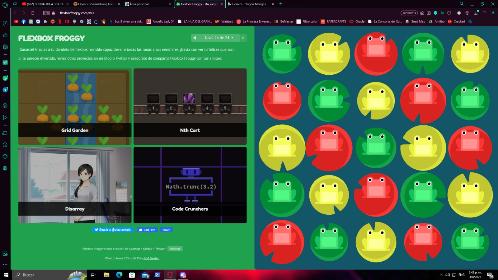

#NATHALY ESTHER RODRIGUEZ POLANCO 2019-1174

# Flexbox en React Native

Flexbox es un sistema de diseño en React Native que permite organizar y posicionar elementos de una interfaz de usuario de manera flexible y adaptable en diferentes dispositivos y tamaños de pantalla. Permite crear diseños fluidos y responsivos con menos código, lo que simplifica el proceso de desarrollo de aplicaciones móviles.

## Principales conceptos de Flexbox en React Native

1. **Contenedor Flex**: Se define un contenedor con `flexDirection`, que determina el flujo principal de los elementos dentro del mismo, ya sea en fila (row) o columna (column).

2. **Propiedad `flex`**: Se asigna a los elementos hijos dentro del contenedor flex para especificar cómo se distribuye el espacio disponible. Los elementos pueden ocupar un porcentaje de espacio o un valor específico utilizando `flex: 1` o `flex: 2`, por ejemplo.

3. **Propiedad `alignItems`**: Se utiliza para alinear los elementos hijos en el eje secundario (perpendicular al `flexDirection`).

4. **Propiedad `justifyContent`**: Controla cómo se distribuyen los elementos a lo largo del eje principal.

5. **Propiedad `flexWrap`**: Define si los elementos deben envolver o no cuando no quepan en una sola línea.

## Comparación con el juego Froggy

El juego Froggy es una herramienta interactiva y educativa para aprender Flexbox mediante ejercicios prácticos. Aunque la documentación oficial de React Native también proporciona información completa sobre Flexbox, el juego Froggy ofrece una experiencia más visual e interactiva para los desarrolladores, lo que puede hacer que el aprendizaje sea más divertido y efectivo.

**Documentación oficial de React Native**:
- Ventajas: Proporciona detalles técnicos exhaustivos sobre Flexbox en React Native, explicando cada propiedad y su comportamiento en profundidad.
- Desventajas: Al ser más técnica, puede resultar menos atractiva para principiantes o desarrolladores que prefieran una forma de aprendizaje más interactiva.

**Juego Froggy**:
- Ventajas: Ofrece una experiencia interactiva y visual para aprender Flexbox, lo que facilita la comprensión de los conceptos clave y su aplicación práctica.
- Desventajas: Puede que no cubra todos los detalles técnicos avanzados, ya que su enfoque principal es la comprensión práctica y la familiarización con los conceptos básicos.

En conclusión, la documentación oficial de React Native Flexbox es una fuente completa y detallada para comprender el sistema de diseño, mientras que el juego Froggy es una alternativa divertida y práctica para aprender Flexbox mediante ejercicios interactivos. Los desarrolladores pueden beneficiarse de ambos recursos para dominar Flexbox en React Native.

**Evidencia del juego**

